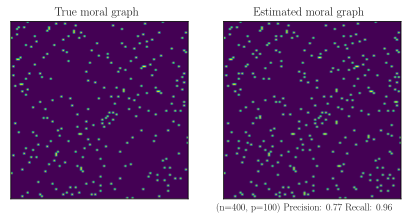

# Stability Approach to Regularization Selection (StARS) for High Dimensional Graphical Models



This repository contains an implementation of the StARS algorithm, from the paper *"Stability Approach to Regularization Selection (StARS) for High Dimensional Graphical Models"* by Liu, Kathryn Roeder, Larry Wasserman (https://arxiv.org/pdf/1006.3316.pdf).

## Requirements

Minimum requirements (see [setup.py](setup.py)):

- Standard library
- `numpy`

To run with the [Graphical Lasso](https://scikit-learn.org/stable/modules/generated/sklearn.covariance.GraphicalLasso.html) from Scikit-learn:
- Standard library
- `numpy`
- `sklearn>=0.20`

## Using the Graphical Lasso estimator from sklearn

The function `stars.glasso.fit` selects the regularization parameter via StARS, and then runs Scikit-learn's [Graphical Lasso](https://scikit-learn.org/stable/modules/generated/sklearn.covariance.GraphicalLasso.html) over the data.

Parameters:

- **X** (*np.array*): Array containing n observations of p variables. Columns are the observations of a single variable
- **beta** (*float*, optional): Maximum allowed instability between subsample estimates. Defaults to 0.05, the value recommended in the paper.
- **N** (*int*, optional): Number of subsamples, must be divisor of n. Defaults to the value recommended in the paper, i.e. `int(n / np.floor(10 * np.sqrt(n)))`.
- **start** (*float*, optional): Starting lambda in the search procedure. Defaults to 1.
- **step** (*float*, optional): Initial step at which to increase lambda. Defaults to 1.
- **tol** (*float*, optional): Tolerance of the search procedure, i.e. the search procedure stops when the instability at a given lambda is below `tol` of `beta`. Defaults to 1e-5.
- **max_iter** (*int*, optional): Maximum number of iterations for which the search procedure is run, i.e. the maximum number of times the estimator is run. Defaults to 20.
- **glasso_params** (*dict*, optional): Dictionary used to pass additional parameters to `sklearn.covariance.GraphicalLasso`. You can find a list of available parameters [here](https://scikit-learn.org/stable/modules/generated/sklearn.covariance.GraphicalLasso.html). Defaults to `{}`.
- **debug** (*bool*, optional): If debugging messages should be printed during execution. Defaults to `False`.

Returns:

- **estimate** (*np.array*): The adjacency matrix of the resulting graph estimate.

Example (running `stars.glasso.fit` with default parameters and debug messages):

```python
import numpy as np
import stars, stars.glasso

# Generate data from a neighbourhood graph (page 10 of the paper)
true_precision = stars.neighbourhood_graph(100)
true_covariance = np.linalg.inv(true_precision)
X = np.random.multivariate_normal(np.zeros(100), true_covariance, size=400)

# Run StARS + Graphical lasso
estimate = stars.glasso.fit(X, debug=True)
```

Example (running `stars.glasso.fit` with additional parameters for `sklearn.covariance.GraphicalLasso`):

```python
import numpy as np
import stars, stars.glasso

# Generate data from a neighbourhood graph (page 10 of the paper)
true_precision = stars.neighbourhood_graph(100)
true_covariance = np.linalg.inv(true_precision)
X = np.random.multivariate_normal(np.zeros(100), true_covariance, size=400)

# Set additional parameters for the Graphical Lasso estimator
args = {'max_iter': 100, 'mode': 'lars'}

# Run StARS + Graphical lasso
estimate = stars.glasso.fit(X, glasso_params = args)
```

## Using an estimator of your choice

***Estimator function***

StARS can be used to select the regularization parameter for other graphical model estimators. To do this, your estimator must be wrapped in a function which takes two arguments:

- **subsamples** (*np.array*): An array containing the subsampled data, of dimension `Nxbxp`, where `N` is the number of subsamples, `b=n/N` and `p` is the number of variables.
- **lambda** (*float*): The regularization value at which to run the estimator.

It must return a `Nxpxp` *np.array* containing the adjacency matrix (0s or 1s) of the estimate for each subsample. There is a complete example below.

Parameters (for `stars.fit`):

- **X** (*np.array*): Array containing n observations of p variables. Columns are the observations of a single variable
- **estimator** (*function*): Wrapper function for your estimator, as described above.
- **beta** (*float*, optional): Maximum allowed instability between subsample estimates. Defaults to 0.05, the value recommended in the paper.
- **N** (*int*, optional): Number of subsamples, must be divisor of n. Defaults to the value recommended in the paper, i.e. `int(n / np.floor(10 * np.sqrt(n)))`.
- **start** (*float*, optional): Starting lambda in the search procedure. Defaults to 1.
- **step** (*float*, optional): Initial step at which to increase lambda. Defaults to 1.
- **tol** (*float*, optional): Tolerance of the search procedure, i.e. the search procedure stops when the instability at a given lambda is below `tol` of `beta`. Defaults to 1e-5.
- **max_iter** (*int*, optional): Maximum number of iterations for which the search procedure is run, i.e. the maximum number of times the estimator is run. Defaults to 20.
- **debug** (*bool*, optional): If debugging messages should be printed during execution. Defaults to `False`.

Returns:

- **estimate** (p x p np.array): The adjacency matrix of the resulting graph estimate.

An example:

```python
import numpy as np
import stars

# Define a dummy estimator (returns the same estimate for all subsamples)
def estimator(subsamples, lmbda):
    p = subsamples.shape[2]
    A = np.triu(np.random.uniform(size=(p,p)), k=1)
    A += A.T
    A = A > 0.5
    return np.array([A] * len(subsamples))

# Generate data from a neighbourhood graph (page 10 of the paper)
true_precision = stars.neighbourhood_graph(100)
true_covariance = np.linalg.inv(true_precision)
X = np.random.multivariate_normal(np.zeros(100), true_covariance, size=400)

# Run StARS + Graphical lasso
stars.fit(X, estimator)
```
